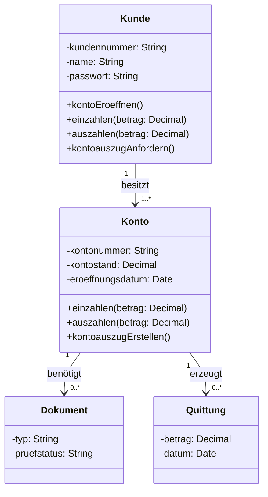

```mermaid
classDiagram
    class Kunde {
        -kundennummer: String
        -name: String
        -passwort: String
        +kontoEroeffnen()
        +einzahlen(betrag: Decimal)
        +auszahlen(betrag: Decimal)
        +kontoauszugAnfordern()
    }
    class Konto {
        -kontonummer: String
        -kontostand: Decimal
        -eroeffnungsdatum: Date
        +einzahlen(betrag: Decimal)
        +auszahlen(betrag: Decimal)
        +kontoauszugErstellen()
    }
    class Dokument {
        -typ: String
        -pruefstatus: String
    }
    class Quittung {
        -betrag: Decimal
        -datum: Date
    }

    Kunde "1" --> "1..*" Konto : besitzt
    Konto "1" --> "0..*" Dokument : benötigt
    Konto "1" --> "0..*" Quittung : erzeugt
```
